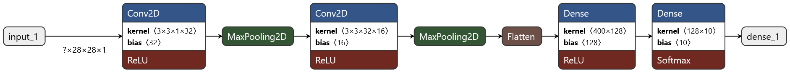

# Digits

Digit classification with tensorflow: https://d-costa.github.io/digits/

## Features

- [x] Optional centering: understand what areas are more relevant to identify digits;
- [x] Probability for each digit;

## Neural Net Architecture

The [MNIST](http://yann.lecun.com/exdb/mnist/) dataset is used for training a CNN network with the following architecture:




| Layer                      | Output Shape        | Param # |
| -------------------------- | ------------------- | ------- |
| InputLayer                 | [(None, 28, 28, 1)] | 0       |
| Conv2D (32, (3, 3), relu)  | (None, 26, 26, 32)  | 320     |
| MaxPooling2D (2,2)         | (None, 13, 13, 32)  | 0       |
| Conv2D (16, (3, 3), relu)  | (None, 11, 11, 16)  | 4624    |
| MaxPooling2                | (None, 5, 5, 16)    | 0       |
| Flatten                    | (None, 400)         | 0       |
| Dense  (relu)              | (None, 128)         | 51328   |
| Dense  (softmax)           | (None, 10)          | 1290    |

- Total params: 57,562
- Trainable params: 57,562
- Non-trainable params: 0
- ~15.000 examples of the training set are used as validation
- Adam is used as the optimizer with 15 epochs and
batch size of 64.

Test loss: 0.050  
Test accuracy: 98.97%

## Development

1. Install the required python packages:
   ```shell
   pip install -r requirements.txt
   ```

1. Modify the model architecture in [train.py](src/train.py) and train the model:
   ```shell
   python train.py
    ```
   The model is saved in a file named *model.h5*.

1. Test the trained model:
   ```shell
   python test.py
    ```

1. Convert the model to use it in tensorflowjs:
      ```shell
   ./convert.sh
    ```
   The model is saved in */public/tfjs*

1. Open index.html in your browser

## Acknowledgements

- Carlos Aguayo : https://github.com/carlos-aguayo/carlos-aguayo.github.io
- CNN architecture render: https://netron.app/
